# Advanced Deep Learning Systems Coursework

## Lab 0: Introduction to Mase

### Tutorial 1: Introduction to the Mase IR, MaseGraph and Torch FX passes

**Task:** Delete the call to replace_all_uses_with to verify that FX will report a RuntimeError.

We observe a runtime error when deleting the `replace_all_users_with`. This error raised is it tried to erase the node bert_embeddings_dropout, but it already has 6 users connected to it in the graph.

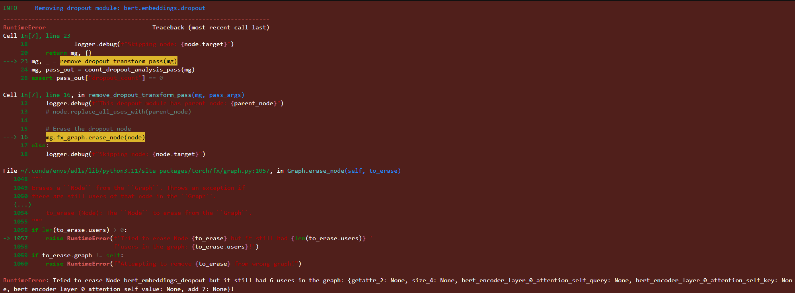

### Tutorial 2: Finetuning Bert for Sequence Classification using a LoRA adapter

In tutorial 2, we finetune the bert model we LoRA adapter

**Task:** Remove the attention_mask and labels arguments from the hf_input_names list and re-run the following cell. Use mg.draw() to visualize the graph in each case. Can you see any changes in the graph topology? Can you explain why this happens?

The differences between using all `hf_input_names` and removing attention or labels is the data flow which is seen in the mase graph svg. When the attention or labels are removed, the attention mask on the top and also the labels with the cross entropy loss in the bottom is not present.

The missing part of the graph are shown below.


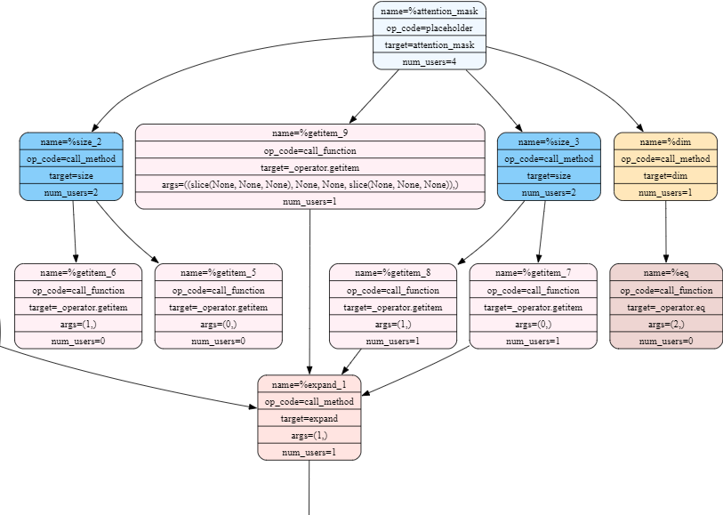

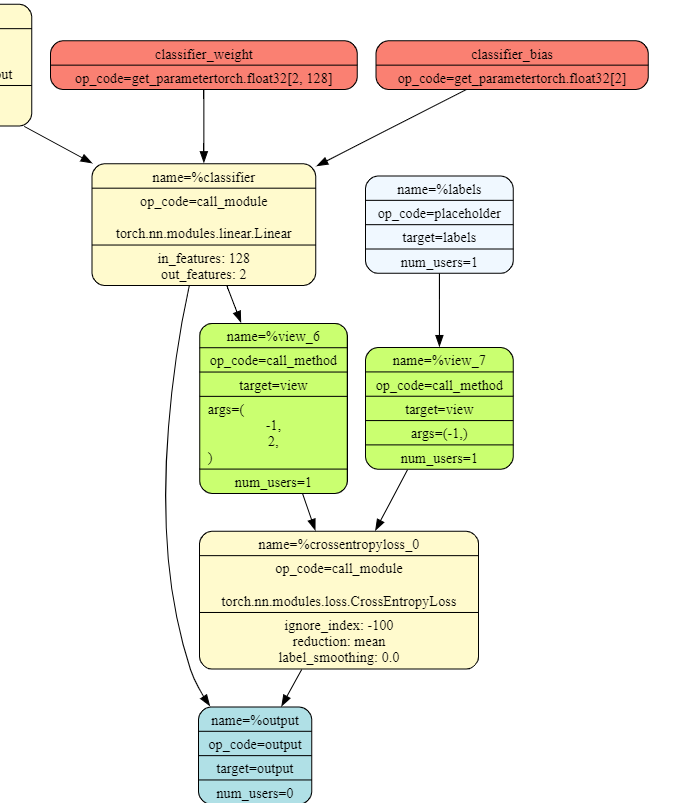

The reason for this, is `hf_input_names` specfiy the input names to look out for when performing hugging face symbolic tracing. Hence if `attention_mask` or `labels` is not provided it, it will not look for those.

## Lab 1: Model Compression (Quantization and Pruning)

### Tutorial 3: QAT on Bert

Tutorial 3 focused on performing quantiziation on the Bert model. There are 2 ways to quantize. First can be done through PTQ (Post Training Quantization) where the model is quantized based on layer type which is stored as `mase_op`. This ignores any accuracy aware quantization and hence may result is significant accuracy loss compared to native model. 

On the other hand, QAT (Quantization Aware Training) can be performed so that the model is trained after quantization to improve accuracy. It is important to note, this adds to the training/quantization overhead which did not exist when performing PTQ. 

Although this provides good results, this is also suboptimal since quantization can inherently limit the maximum accuracy that can be achieved. Later tutorials shall explore more better quantization search.


**Task:** Explore a range of fixed point widths from 4 to 32

Plot separate curves for PTQ and QAT at each precision to show the accuracy on the IMDb dataset.

<figure class="image">
  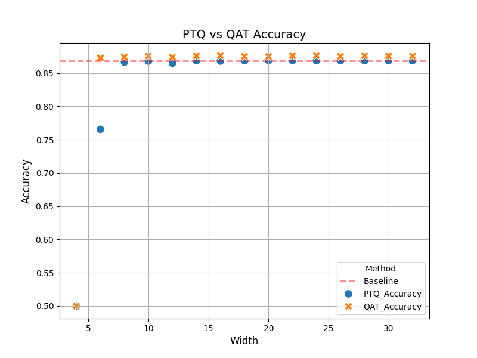
  <figcaption>Figure 1: PTQ and QAT accuracy plot</figcaption>
</figure>


### Tutorial 4: Unstructed pruning on Bert

This tutorial focused on pruning on Bert. We only focus on unstructured pruning where indiviual weights and connections are removed, as compared to removing a channel, layer or filter as in structured pruning. 

The benefit of pruning a model is that it reduces the overall size of the model as well as reduces the total number or computations performed. This hence reduce inference time and allows running the models on low power devices. Further, pruning can also act as a form of regularisation and hence it can also allow model generalisation and prevent overfitting.

Given its advantages it also comes with challenges. Pruning a model may reduce the model accuracy, especially with higher sparsity (trade-off between speed and accuracy). To improvise, the pruned model can be fine tuned to improve accuracy (seen in figure 2). 

Also different methods can be used to pruning the model. 2 of which we consider here in our study are Random and L1-Norm. L1-Norm prunes weights that have lowest L1 normalised values, which indicate less important weights. This can be seen from figure 2, since L1-Norm maintains better accuracy with larger sparsity.

**Task:** Vary the sparsity from 0.1 to 0.9.

Plot a figure where the x-axis is the sparsity and the y-axis is the highest achieved accuracy on the IMDb dataset. Plot separate curves for Random and L1-Norm methods to evaluate the effect of different pruning strategies.

<figure class="image">
  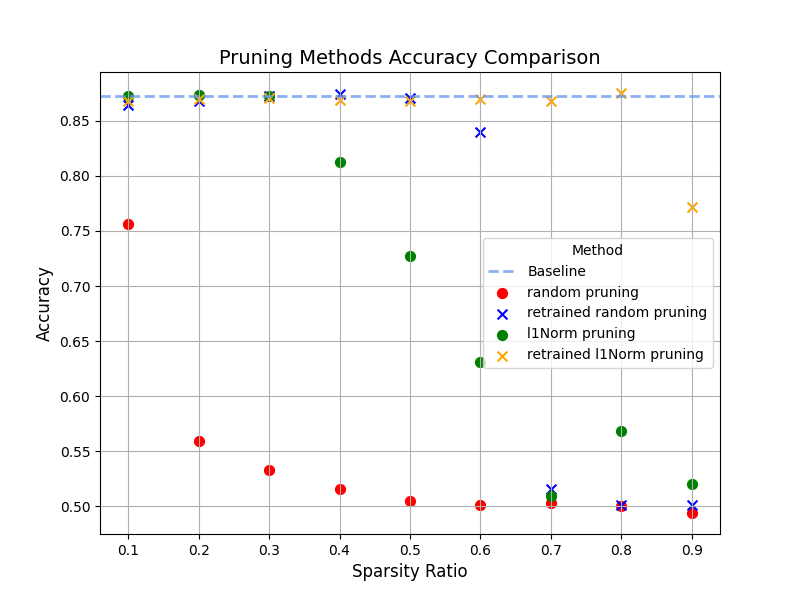
  <figcaption>Figure 2: Pruning methods Accuracy plot</figcaption>
</figure>

## Lab 2: Neural Architecture Search

### Tutorial 5: NAS with Mase and Optuna

In tutorial 5 we extend our study to search of optimal arcitectures for our required task.

First we perform a basic arcitecture search with a search space as suggested by the [NAS-BERT Paper](https://arxiv.org/abs/2105.14444). This introduces us to the optuna NAS framework. 

We use different samplers from optuna, such as GridSampler, TPESampler and RandomSampler. We compare each of them and choose the best for latest tasks and tutorials.

Further, use the MASE compression pipeline to perform compression aware optuna serach. This can be divided into 2 cases based on whether we perform post compression training. 

The cases that were compared can be divided into the following:

| Type                                  |Epochs | Best accuracy |
| :------------------------------------ | :---: | ------------: |
| Search Without Compression            |   2   | 0.88160       |
| Compression Aware Search              |   2   | 0.87264       |
| Search with Post Compression training |  1+1  | 0.87580       |

The reason to use 1 epoch pre compression and 1 epoch post compression, in type 3, was to ensure that total epochs used accross the types where same and hence compareable (i.e. convergence speed within the same training time).

We can observe that search with post compression training performs better than without. This is expected as training after compression allows model to finetune to the new structure and compensate for the missing weights. 

Yet, it cannot match the performance of the baseline model without compression.

**Task 1** 

Explore using the GridSampler and TPESampler in Optuna. Plot a figure that has the number of trials on the x axis, and the maximum achieved accuracy up to that point on the y axis. Plot one curve for each sampler to compare their performance.

Below we show a figure with the result for the above task:
<figure class="image">
  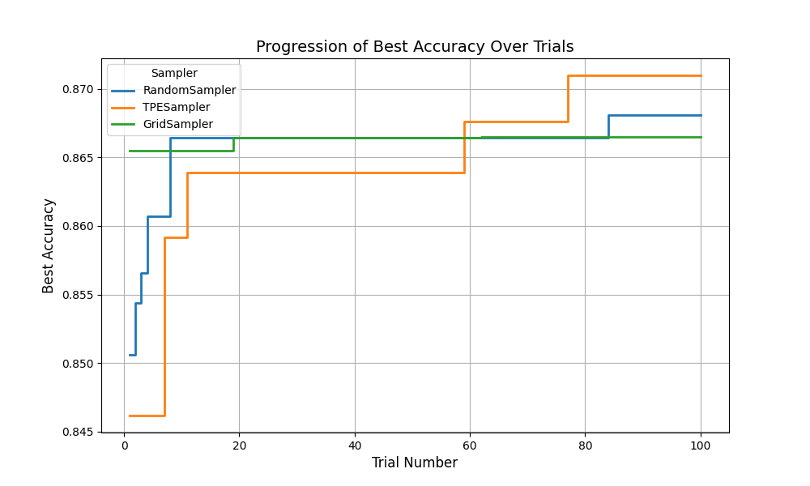
  <figcaption>Figure 3: Sampler Comparison</figcaption>
</figure>

**Task 2** 

Perform compression aware search flow. Plot a new figure that has the number of trials on the x axis, and the maximum achieved accuracy up to that point on the y axis. There should be three curves: 1. without compression, compression-aware search, and compression-aware search with post-compression training.

Below we show the figure with the result for the above comparison. This result is also tabluated above:
<figure class="image">
  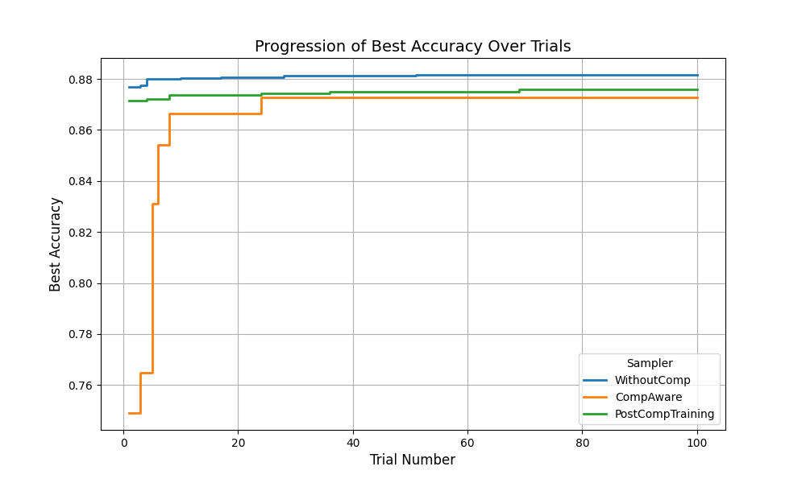
  <figcaption>Figure 3: Strategy Comparison</figcaption>
</figure>


## Lab 3: Mixed Precision Search

### Tutorial 6: Mixed Precision Quantization Search with Mase and Optuna

In this tutorial, we perform a more advanced quantisation search. We take into account the different linear layer precisions that MASE provides, and perform a search to indentify how different precisions can affect different layers, and hence obtain the best accuracy compressed accuracy. Adding different datatypes and precisions allow the search to identify the best type and precision for the particular layer. This is because the numeric range and precision of values are likely different for each layer.

The following storage DataTypes where used in our study:

- [x] LinearInteger
- [x] LinearMinifloatDenorm
- [x] LinearMinifloatIEEE
- [x] LinearLog
- [x] LinearBlockFP
- [ ] LinearBlockMinifloat
- [x] LinearBlockLog
- [x] LinearBinary
- [x] LinearBinaryScaling
- [ ] LinearBinaryResidualSign

> LinearBlockMinifloat was not used since the backward pass for this implementation was broken. I pointed this out in [issue #262]>(https://github.com/DeepWok/mase/issues/262).
>
> LinearBinaryResidualSign was not used since this has not been implemented yet as seen [here](https://github.com/DeepWok/mase/blob/488d49e2b838d7121ae73ead04e96a1ba642cf68/src/chop/nn/quantized/functional/linear.py#L542C1-L548C30).
>
> I also noted that the linearMinifloatIEEE defintion in functional is duplicated. I created an [issue #260](https://github.com/DeepWok/mase/issues/260) and a [PR #259](https://github.com/DeepWok/mase/pull/259) for the same 😄.
>
> Also for Binary types, bipolar parameter did not work when set to false. Did not find time to debug this, but was found to be common problem with others too. 

In the study completed, each of the above DataTypes and the Torch provided LinearLayer are used. So each model consists of LinearLayer or any one of the above. This comparison is done to rougly get an idea of how each type impacts accuracy. 

Since the behaviour of each layers are different, we would ideally like each layer with different Datatype and precision based on which works best for the specifc layer. This is shown in the figure 5, as the "mixed" line, but it doesnt achieve as good as the others. My explanation for this is because the number of trials is still set at 100 (for comparison reasons). Since the search space is now larger, it will need more trials inorder to find a accuracte architecture.

**Task 1** 

Explore different layers to have widths in the range [8, 16, 32] and fractional widths in the range [2, 4, 8]. Plot a figure that has the number of trials on the x axis, and the maximum achieved accuracy up to that point on the y axis.

Below we show a figure with the result for the above task:
<figure class="image">
  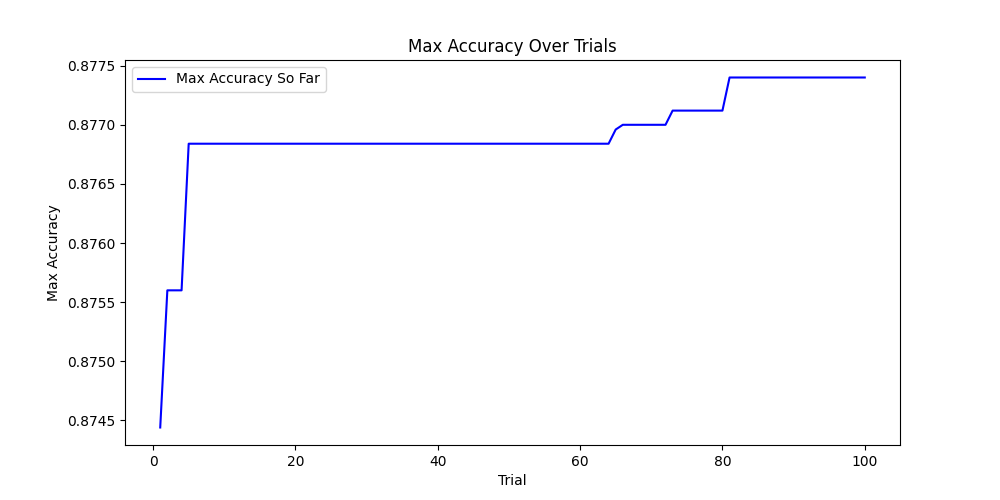
  <figcaption>Figure 4: Mixed Precision search with LinearInteger</figcaption>
</figure>

**Task 2** 

Extend the search to consider all supported precisions for the Linear layer in Mase, including Minifloat, BlockFP, BlockLog, Binary, etc. Plot a figure that has the number of trials on the x axis, and the maximum achieved accuracy up to that point on the y axis. Plot one curve for each precision to compare their performance.

Below we show a figure with the result for the above task:
<figure class="image">
  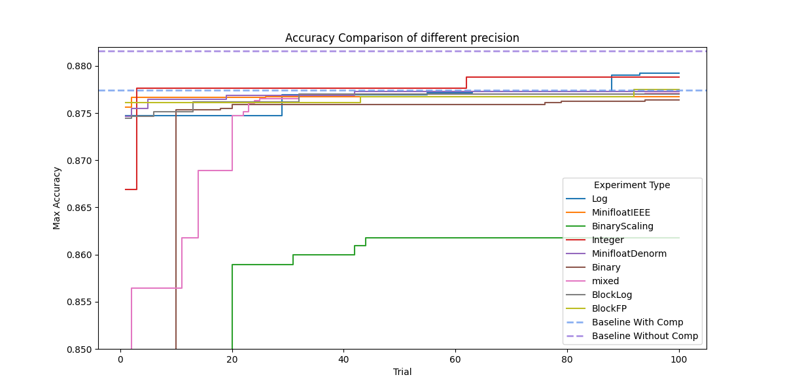
  <figcaption>Figure 5: Mixed Precision search with all DataTypes</figcaption>
</figure>


## Lab 4: (Software Stream) Performance Engineering

Software part of Lab4 focuses on how torch models can be accelerated using GPU, further optimised based on runtime heuristics to optimise the model execution using torch's JIT compiler, and at last how to optimise execution using custom kernels.

**Task 1**

Task1 focuses on observing the performance of using model with and without `torch.compile`, on both CPU on GPU. 

First we test the performace with CPU. We observe the **torch compiled model takes longer** than the model without compilation. This is observed with iterations set to 5. On further tests, increasing the iterations show better results and eventually the average time taken is less than the model without `torch.compile`. To obeserve this, we also plot the time taken for each iteration:
<figure class="image">
  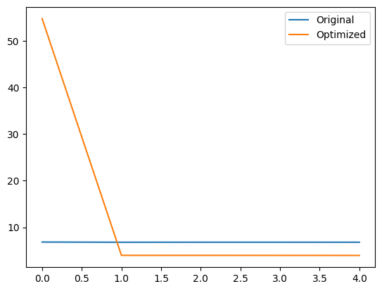
  <figcaption>Figure 6: Time taken by CPU to perform inference on Bert model (x-axis is iteration number while y-axis is time in seconds)</figcaption>
</figure>

It is quite clear that the optimised model, takes time to perform JIT recompilation to improve performance, after which there is a significant performance improvement compared to original model.

We also perform the same test on GPU. Similar results were observed. This time, the number of iterations was set to 1000 inorder to reduce sampling noise due to very small times.

<figure class="image">
  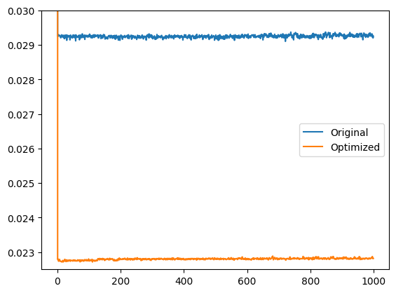
  <figcaption>Figure 7: Time taken by GPU to perform inference on Bert model (x-axis is iteration number while y-axis is time in seconds)</figcaption>
</figure>

The obeservation is similar, we first see a very slow model, after which the speedup is nearly 80% faster!

**Task 2**

Task 2 focuses on performance improvements using custom kernels. Custom kernels allow *kernel fusion*, which enables multiple operations to be done simultaneously, reducing memory load overheads. An example is performing the linear layer matrix multiplication and its corresponding activation function (like Relu) together.

For this task, we profile SPDA (Scalaed Dot Product Attention) which is used in transformer architectures. We use a naive implemenation using basic pytorch functions to allow us to compare performance with fused kernels. The method behind fused SPDA is mentioned in [FlashAttention paper](https://arxiv.org/abs/2205.14135). Pytorch already implements a variant of this such that all these operations are fused into a single cuda kernel.

First, we profile using similar steps followed in task 1. On CPU we see that the fused kernel is faster than the naive implementation straightaway. 

<figure class="image">
  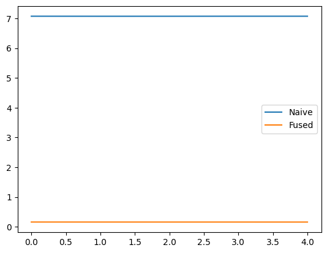
  <figcaption>Figure 8: Time taken by CPU to perform forward pass on SDPA (x-axis is iteration number while y-axis is time in seconds)</figcaption>
</figure>

On the GPU, there is a significant improvement after the first 2 iteration. The speedup between naive and fused is about 60% faster.

<figure class="image">
  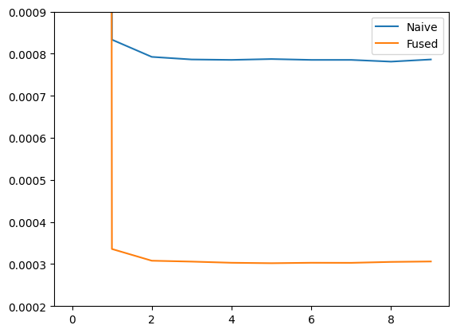
  <figcaption>Figure 9: Time taken by GPU to perform forward pass on SDPA (x-axis is iteration number while y-axis is time in seconds)</figcaption>
</figure>

**Task 3**

Further custom kernels allow running operations on custom datatypes such as MXINT8 (as mentioned [here](https://www.opencompute.org/documents/ocp-microscaling-formats-mx-v1-0-spec-final-pdf)). This allows operations to be executed on quantized datatypes by using a dequantization and quantization kernel. Though this adds computation overhead, it can significantly reduce memory consumption, hence allows running larger models on smaller hardware. 

We run the colab miminal notebook (with a few modifications to run without terminal, rather within .ipynb). The MXINT8 datatype consumes significantly lower memory. The results for the comparison is as below:

```
FP32 model peak memory: 2908.2578 MB
FP32 single inference time: 0.1017 s
FP32 prediction: joy
FP32 top3 logits: ...
MXINT8 model peak memory: 978.0288 MB
MXINT8 single inference time: 0.1342 s
MXINT8 prediction: joy
MXINT8 top3 logits: ...
```

A profiling function was also used to calculate inference latency, which was averaged over 500 iterations. It was observed that on average over lots of iterations, the inference latency is lower with FP32 than MXINT8. This represents the trade-off between memory consumption and inference latency. Although, it is to be noted within hardware support for the datatype, its likely inference latency would be lower.

<figure class="image">
  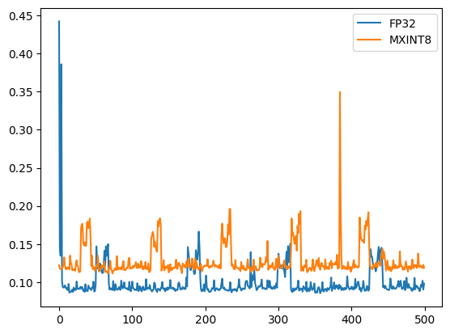
  <figcaption>Figure 10: Recorded Inference latency (x-axis is iteration number while y-axis is time in seconds)</figcaption>
</figure>

From figure 8, it can be seen the inference latency (on average) is lower for FP32 datatype. The random spikes in uncertain and is likely noise (this was run on colab, while previous figures are from RCS cluster).


Q1. How does MXINT8 benefit custom hardware if both the activation and weights in a linear layer are quantized to MXINT8?

If both the weights and activation are quantized, custom hardware can employ fused kernel operations to reduce memory lookup overheads, since the memory load latency is only incurred once. 

Further with regards to custom hardware such as FPGAs, the arithmetic operations can be largely simplified. If the operations are between numbers in the same block, we do not need to perform any exponent operation, and fixed operations can be done for the mantissa. Regarding, different block operations, FPGAs can employ specialized units for exponent alignment for addition and shared exponent handling for multiplication.

Further, GPUs could later in future have hardware support for such datatypes and hence can make execution even faster. An example of these are Nvidia GPU supporting types such as TF32, BFLOAT16, INT8, etc..

Q2. What is the purpose of the variable dont_need_abs and bias in the C++ for loop?

The key idea is that Bfloat16 has an implicit leading one, which MXINT8 does not. Within the C++ simulated version, the `dont_need_abs` checks if the leading mantissa bit is 1 (`0x40` is the 7th bit = 1). 
Here, `bias` is a Bfloat16 value composed of (using bitcast) 1bit sign from mxint8 number, 8bit exponent from mxint8 number, 7bit mantissa filled with 0s. This `bias` when subtracted from the bfloat value, will subtract the implicit leading 1. 
If `dont_need_abs` is true (i.e. the leading bit is 1), we do not need to remove the implicit leading 1, but if the the leading bit is 0, subtracting `bias` from the raw BFloat16 value (out) removes the implicit leading 1.

An example is shown below:

```
Number = 0.5

MXINT8 format
exponent = 0b0111_1111
mantisa = 0b0.100000
sign = 0b0

`out` as calculated by simulation
exponent - 0b0111_1111
mantisa = 0b100_0000
sign = 0b0
Since Bfloat16 has implicit 1, this value in Bfloat16 would be 1.5

`bias` as calculated by simulation
exponent - 0b0111_1111
mantisa = 0b000_0000
sign = 0b0
Since Bfloat16 has implicit 1, this value in Bfloat16 would be 1.0

In this case since leading bit of MXINT8 mantisa is 0, it would perform the subtraction, i.e. 1.5 - 1.0, which is correctly calculated to 0.5 in Bfloat16
```

Q3. How does cta_tiler partition the data for copy?

In CUDA programming, CTA (cooperative thread array) is an array of threads that execute a kernel in parallel (ref: [Nvidia Docs](https://docs.nvidia.com/cuda/parallel-thread-execution/#thread-hierarchy)). CTA can be a 1D, 2D or 3D shape.

In the CUDA (CUTE) code provided, we see `cta_tiler` represents the shape of the CTA tile being used (2D in this case). This is important and needs to be based on the group size of the MXINT8 used.
This is because it allows efficient use of the the the threads in the block. In the code, we use a total of 1024 threads per block (max limit per block in 7.5 CUDA capability), which are tiled with group size <= rows. 
`local_tile` creates this data with this tile shape for the specfic block based on BlockIndex. For instance, if we want to dequantize a tensor of 2048 elements with a group size of 128, we would use 2 blocks, 
with 8 groups processed in each block. Here the CTA tile is of shape (128, 8). Tensors `gX`, `gScale`, `gY` represent the mantissa, shared exponent and dequantized output respectively. These are built using these CTA tile 
shape that has been predefined, the only exception being `gScale` which is only of shape 8, which the number of groups in that block (since exponent shared between all numbers in group). 

It is also important to note, `cta_tiler` is a shape in coordinate space, and does not represent how data is layed out in memory, the next question answers this.


Q4. How does layout_sX partition the threads in a threadblock for computation?

`layout_sX` is the index layout that is created in the same shape as the tile `cta_tiler`. Before computation, the shape in coordinate space need to be assigned to index space (in memory). This is important step, since 
if the threads access the memory in sequential order, we can enable [coalesced memory access](https://developer.nvidia.com/blog/how-access-global-memory-efficiently-cuda-c-kernels/) which is very efficient, no matter what shape in coordinate space we operate in.
By assigning threads within a block, to each index in `layout_sX` in the same sequential order, we achieve this.


Sources for the above answers in Q3 and Q4 were:

[Nvidia Docs: CUTLASS](https://github.com/NVIDIA/cutlass/blob/main/media/docs)

[CUDA Lecture Notes by Christian Mills](https://christianjmills.com/posts/cuda-mode-notes/lecture-015/#:~:text=local_tile%20%3A%20Partitions%20a%20tensor%20into,tensor%20among%20threads%20or%20warps.)

[Nvidia Dev Forum: Optimial Block Size](https://forums.developer.nvidia.com/t/how-to-decide-the-optimal-block-size-in-cuda/14906)

[Stackoverflow: CUDA memory coalescing](https://stackoverflow.com/questions/5041328/in-cuda-what-is-memory-coalescing-and-how-is-it-achieved)


Q5. Why the saved GPU memory is not exactly (32 - (8+8/32))/32 = 74.2%?

This is likely because only linear layers are replaced with the quantised version, and hence other layers still occupy more memory.
Further, there other data that needs to be stored in GPU memory. The input data, in this case for inference, has not be quantized and still consumes original memory size.
CUDA context consumes memory to store all the management data to control and use the device.
Kernel Code is also stored in GPU memory, which is basically the instructions to execute in the GPU.


